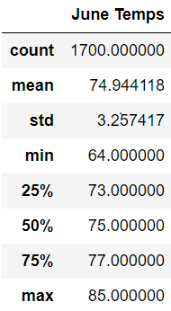
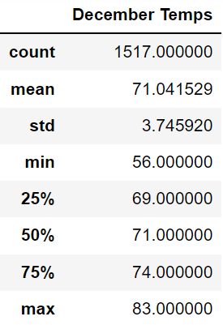

# Surfs Up Statistical Analysis
Executed advanced data storage and retrieval using SQLite, SQLAlchemy, Flask, and Python coding in Jupyter notebook.
## Overview of the statistical analysis
### Purpose
The purpose of this statistical analysis is to compare and analyze the temperatures for the months of June and December. This information will then be used to determine if a surf/ice cream shop will thrive on the island of Oahu. Should the statistical data return favorable results, investors would be most likely to invest in this business.

## Results
Based on the results below, comparing the summer month and winter month, the temperatures are only slightly different. This proves to be a year-round, sustainable business.
### Summary DataFrame: June Temperature
     

### Summary DataFrame: December Temperatures

### Three key differences in weather between June and December
1. The average temperature for June and December are 75 and 71 degrees, respectively. This only shows a three degree difference.
2. The minimum temperature for June and December are 64 and 56, respectively, showing a less than ten degree difference.
3. Lastly, the maximum temperatures for June is 85 and December, 83. Just a two degree difference.

## Summary
